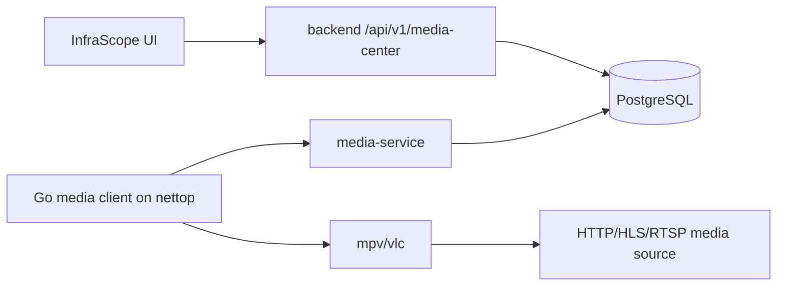

# Media Service Roadmap

Цель: централизовать видео и музыку для неттопов, снизить нагрузку на сами устройства и убрать ручное управление файлами на местах.

## Целевая схема



## Первый слой

- `mediaassignment` хранит назначение медиа на конкретный `MediaPlayer`.
- `backend` управляет назначениями через `/api/v1/media-center/assignments/{player_id}`.
- `media-service` отдает клиентский manifest: `/clients/{player_id}/manifest`.
- `clients/media-agent-go` периодически забирает manifest и запускает локальный плеер.

Запуск сервиса:

```bash
docker compose up -d --build backend media-service
```

Пример запуска клиента на неттопе:

```bash
MEDIA_SERVICE_URL=http://<server-ip>:8014 \
MEDIA_DEVICE_ID=<media-player-uuid> \
MEDIA_CLIENT_TOKEN=<MEDIA_CLIENT_TOKEN> \
MEDIA_PLAYER_BIN=mpv \
./media-agent
```

## Следующие шаги

1. Добавить UI управления назначением в карточку/страницу медиаплеера.
2. Добавить библиотеку медиа: загрузка файла, внешний URL, HLS/RTSP stream, активность.
3. Добавить групповые назначения по магазинам/типам устройств.
4. Добавить heartbeat клиента: версия клиента, текущий revision, состояние плеера, ошибка запуска.
5. Добавить режимы расписаний: рабочие часы, праздничные ролики, аварийное объявление.
6. Добавить локальный кеш на клиенте, чтобы короткий обрыв сети не останавливал воспроизведение.
